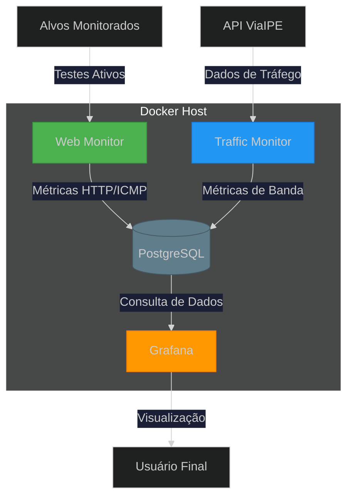
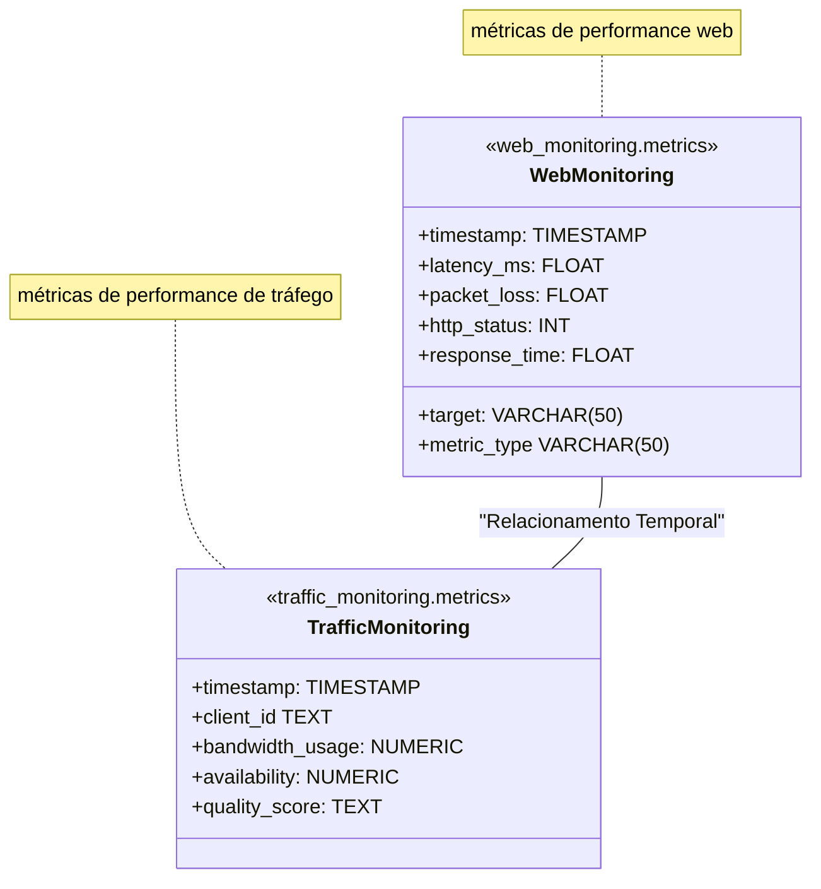
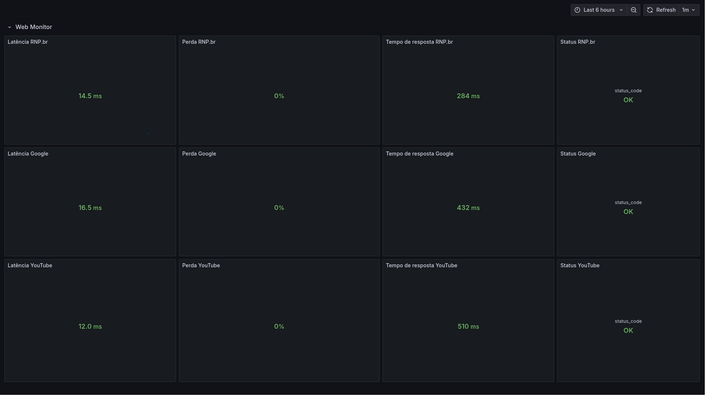
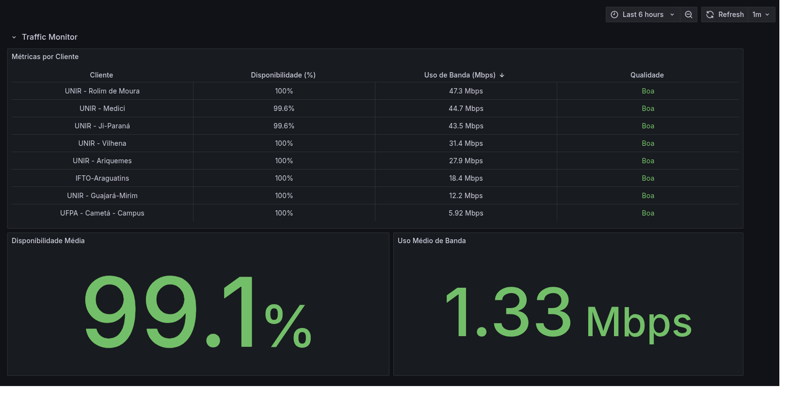

# 🌐 Sistema de Monitoramento de Rede  
**Prova Prática - Vaga DevOps RNP**  
*Solução completa para monitoramento de infraestrutura com visualização em tempo real*


[](https://opensource.org/licenses/MIT)

---

## 📌 Visão Geral

Sistema de monitoramento de rede com arquitetura containerizada que oferece:

✅ Testes ativos de conectividade ICMP/HTTP  
✅ Coleta de métricas de desempenho de rede  
✅ Armazenamento temporal em banco de dados relacional  
✅ Dashboards em tempo real para inteligência operacional  
✅ Arquitetura baseada em containers para fácil implantação

---

## 🧩 Diagrama de Arquitetura


## 📊 Fluxo de Dados

### 🔍 Coleta
- **Web Monitor** executa testes de rede a cada **5 segundos** (ping, tempo de carregamento, status HTTP).
- **Traffic Monitor** consome dados da API [ViaIpe](https://viaipe.rnp.br/api/norte) a cada **15 segundos**.

### 💾 Armazenamento
- Dados são persistidos em **tabelas especializadas** no **PostgreSQL**.
- Estrutura otimizada para **consultas temporais**, garantindo performance na leitura e análise histórica.

### 📈 Visualização
- **Grafana** conectado ao PostgreSQL via **driver nativo**.
- Dashboards com **atualização automática**, exibindo latência, disponibilidade, consumo de banda e status dos serviços monitorados.

---

## 🧠 Decisões Técnicas

| Componente     | Escolha          | Justificativa                                      |
|----------------|------------------|----------------------------------------------------|
| Banco de Dados | PostgreSQL       | Familiaridade, driver nativo no Grafana            |
| Agents         | Python           | Ecossistema robusto para testes de rede            |
| Visualização   | Grafana          | Padrão de mercado para observabilidade e métricas  |
| Orquestração   | Docker Compose   | Simplicidade e agilidade em ambientes de testes    |
---

## 🚀 Principais Funcionalidades

- **Arquitetura Conteinerizada** com Docker
- **Monitoramento de Múltiplos Alvos** (Google, YouTube, RNP)
- **Análises de Desempenho** via Grafana
- **Rede Isolada** para maior segurança
- **Boas Práticas em Gestão de Segredos**
- **Coleta Automática de Dados** com agentes Python

---

### 🔧 Componentes do Sistema

#### 1. Agente de Monitoramento Web 📡  
- **Container**: Python customizado em Docker  
- **Funções**:
  - Testes ICMP (Ping)
  - Verificação de disponibilidade HTTP
  - Coleta de Métricas:
    - Latência (ms)
    - Perda de Pacotes (%)
    - Tempo de Carregamento (s)
    - Códigos de Status HTTP
- **Alvos Monitorados**:
  - `google.com`
  - `youtube.com`
  - `rnp.br`

---

#### 2. Monitor de Tráfego 📡  
- **Container**: Python customizado em Docker  
- **Integrações**:
  - API Viaipe (Norte)  
- **Métricas Chave**:
  - Disponibilidade Média (%)
  - Consumo de Banda (Mbps)
  - Índice de Qualidade de Rede (%)

---

#### 3. Banco de Dados 📦  
- **Tecnologia**: PostgreSQL (via container Docker)  
- **Estrutura**:
  - Esquema preparado para armazenar métricas:


---

#### 4. Dashboard de Visualização 📊  
- **Stack**: Container oficial do Grafana  

- **Dashboards Principais**:

  
  

---

#### 5. Orquestração ⚙️  
- **Ferramenta**: Docker Compose v2+  

- **Funcionalidades**:
  - Topologia de rede isolada
  - Gerenciamento via variáveis de ambiente
  - Ordenação de dependências
  - Health checks
  - Boas práticas de gestão de segredos

---

## 🛠 Instalação e Uso

### Pré-requisitos
- Docker 20.10 ou superior  
- Docker Compose 2.12 ou superior
- Git 2.39 ou superior
- Python 3.11 ou superior (para desenvolvimento local)

### Início Rápido
```bash
# Clonar o repositório
git clone https://github.com/vitorbgama/network-monitor.git
cd network-monitor

# Configurar variáveis de ambiente
mv .env.example .env
nano .env  # Edite com suas credenciais

# Subir os serviços
docker compose up -d --build

# Acessar o Grafana
http://localhost:3000  # Credenciais definidas no .env

# Remover serviços
docker compose down -v
```

## 🔧 Troubleshooting
```bash

# Verificar os containers
docker container ls

# Verificar log do Banco de dados
docker logs network-monitor-postgres

# Testar conexão com banco
docker exec network-monitor-postgres pg_isready -U monitor

# Verificar se as tabelas estão criadas
docker exec -it network-monitor-postgres psql -U monitor -d monitoring -c "\dt *_monitoring.*"

#Verificar logs do Agente de Monitoramento Web
docker logs network-monitor-web-agent

#verificar se o Agente de Monitoramento Web está populando a tabela
docker exec -it network-monitor-postgres psql -U monitor -d monitoring -c "SELECT * FROM web_monitoring.metrics ORDER BY id DESC LIMIT 10"

#Verificar logs do Monitor de Tráfego
docker logs network-monitor-traffic-monitor

#verificar se o Monitor de Tráfego está populando a tabela
docker exec -it network-monitor-postgres psql -U monitor -d monitoring -c "SELECT * FROM traffic_monitoring.metrics ORDER BY id DESC LIMIT 10"
```


Maintained by:  
Vitor Brandão de Andrade Gama  
📧 **Contato:** vitorbgama@live.com  
🔗 **GitHub:** https://github.com/vitorbgama/  

---

# Questão 2: Avaliação de Projetos Anteriores no GitHub

### Resposta/Justificativa
Motivo da Não Divulgação:

Os projetos relevantes em DevOps e automação estão atualmente vinculados ao meu emprego atual, hospedados em um ambiente GitLab privado da empresa. Infelizmente, não posso compartilhá-los devido a políticas de confidencialidade e proteção de dados da empresa.

## Projetos Relevantes com Abordagem GitOps

Atualmente existem dois projetos principais dos quais faço parte da operação e manutenção:

---

### 🔐 1. Gestão de Acesso SSH como Código  
**Stack**: GitLab CI, Ansible, Bash  
**Abordagem**:  
GitOps aplicado à gestão de chaves e permissões SSH, com versionamento, automação e auditoria centralizada.

**Impacto**:
-  Pipeline CI/CD com validação de segurança em 3 estágios  
-  Redução de 90% no tempo de provisionamento de acessos  
-  Conformidade e rastreabilidade por meio de merge requests

---

### 🌐 2. Rede Overlay Segura com Nebula  
**Stack**: Nebula, Bash, Vault  
**Abordagem**:  
GitOps de redes privadas com distribuição de certificados e rotas baseada em GitOps. 
  
**Impacto**:  
-  Comunicação Zero-Trust entre ambientes multi-cloud  
-  Criação de rede privada baseada em certificados e autenticação mútua  
-  Automação de gerenciamento de certificados e rotas via GitOps

---


